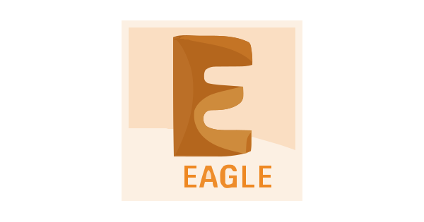

# 🌟 About Me | Hakkımda
junior electrical electronics developer
## 🇹🇷 Türkçe

Merhaba! Ben Balıkesir Üniversitesi Elektrik-Elektronik Mühendisliği öğrencisiyim (GPA: 3.2).  
Gömülü sistemler ve elektronik alanına özel ilgim var. TEKNOFEST Roket Yarışması finalistiyim; takım çalışması ve problem çözme deneyimim mevcut.

Henüz staj yapmadım, ancak yakın zamanda endüstriyel projelerde aktif rol almak için staj yapmayı planlıyorum.  
Şu anda öğrenmeye ve kendimi geliştirmeye odaklı bir junior mühendis adayıyım.

### 📌 İlgi Alanlarım
- Gömülü Sistemler (MCU, sensörler, haberleşme protokolleri)  
- Robotik ve Otomasyon  
- Elektronik Devre ve PCB Tasarımı  
- C / C++ ile düşük seviye programlama  

---

## 🇬🇧 English

Hello! I am an Electrical & Electronics Engineering student at Balıkesir University (GPA: 3.2).  
I have a strong interest in embedded systems and electronics, and I am continuously improving myself in this field.  
As a finalist at the TEKNOFEST Rocket Competition, I gained valuable experience in teamwork, engineering design, and problem solving.

I have not completed an internship yet, but I aim to take part in industrial projects through upcoming internships.  
Currently, I am focused on learning and developing my skills as a junior engineer.

### 📌 My Interests
- Embedded Systems (MCU, sensors, communication protocols)  
- Robotics & Automation  
- Electronic Circuit & PCB Design  
- Low-level programming with C / C++  

---

## 📫 Contact | İletişim

  
  

---

## 🛠️ Languages & Tools

  
  
  
  
  
  
  
  

